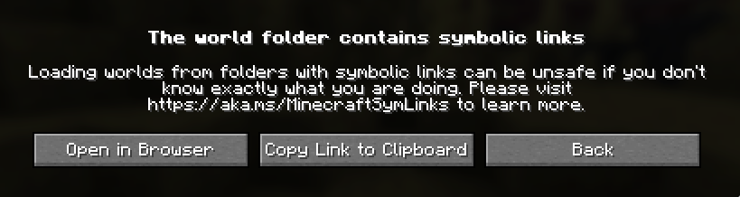

# LetMeSymlink

A mod that disables the **The world folder contains symbolic links** warning.

Upon startup, this mod just writes `[regex].*` to `.minecraft/allowed_symlinks.txt`, which disables the warning.

&copy; Cootshk 2026, Licensed under the GPL-3.0 or later.